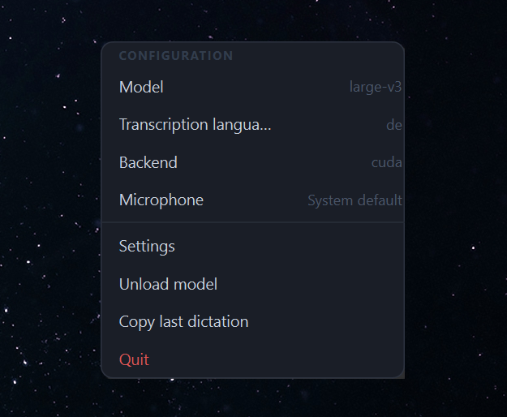
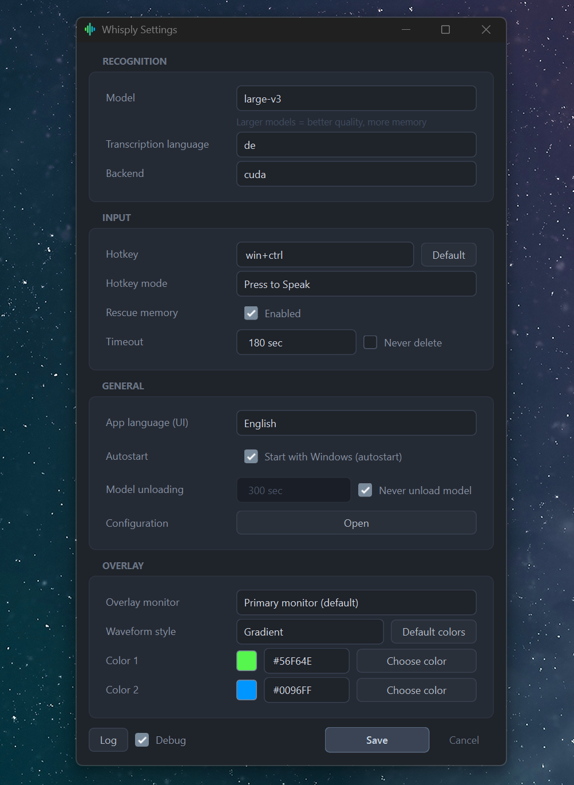
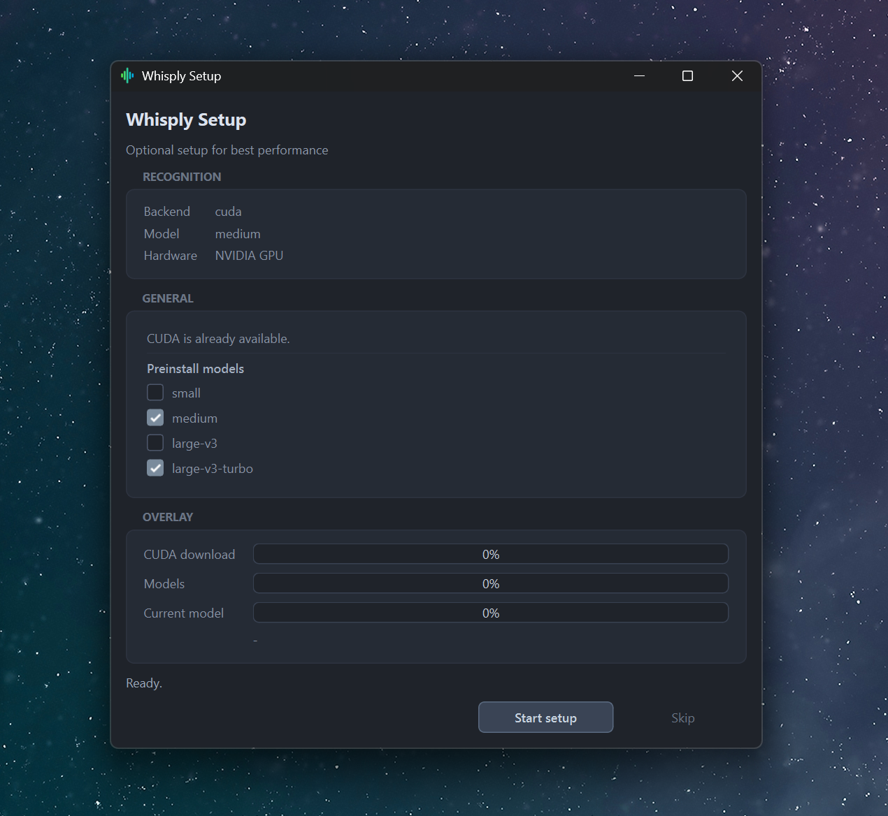
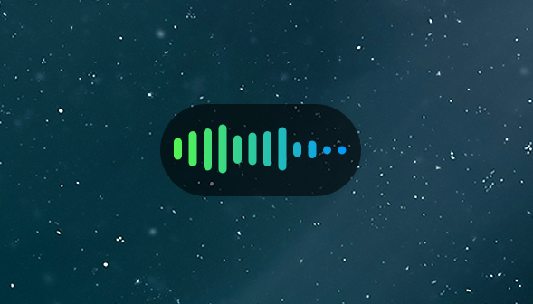

# Whisply

Whisply is a Windows dictation app that records from a global hotkey, transcribes speech locally with `faster-whisper`, and inserts the result into the currently focused app.

It is designed for low-friction everyday use:
- global hotkey
- local transcription
- tray-based controls
- first-run setup for CUDA runtime and recommended models
- installer build for non-technical users

## Status

Whisply is currently focused on Windows desktop use.

Current product direction:
- `faster-whisper` on `cpu` and `cuda`
- OpenVINO backend code exists internally but is currently not exposed as a product path
- models are stored in an app-owned directory
- CUDA runtime can be downloaded on demand
- NVIDIA/CUDA is the primary GPU path; AMD systems currently fall back to CPU-oriented use

## Features

- Global hotkey recording (`win+ctrl` by default)
- Hold-to-speak and press-to-speak modes
- Local speech-to-text with `faster-whisper`
- Model choices: `small`, `medium`, `large-v3`, `large-v3-turbo`
- Optional first-run setup for CUDA runtime and recommended models
- Configurable waveform overlay
- Tray controls for model, backend, microphone, settings, unload, and rescue copy
- Manual model unload from tray
- Rescue memory for the last dictation
- Bilingual app UI: German and English
- Optional file logging with a debug toggle in settings
- Packaged installer via Inno Setup

## Downloads

For end users, use the GitHub Releases page.

Recommended download:
- `Whisply-Installer.exe`

Optional:
- `Whisply.exe` as portable build

## Requirements

Runtime:
- Windows 10/11
- microphone input
- Python is not required for end users when using the packaged app

Development:
- Python 3.10+
- PowerShell
- Inno Setup 6 for installer builds

## Installation

### End users

1. Download `Whisply-Installer.exe` from Releases.
2. Run the installer.
3. Launch Whisply.
4. On first run, Whisply can suggest CUDA runtime and recommended models depending on detected hardware.

### Developers

```powershell
py -m venv .venv
.venv\Scripts\python.exe -m pip install -r requirements.txt
.venv\Scripts\python.exe -m pip install -r requirements-cuda.txt
```

Optional:

```powershell
.venv\Scripts\python.exe -m pip install -r requirements-openvino.txt
.venv\Scripts\python.exe -m pip install -r requirements-optional.txt
```

## Run from source

```powershell
.venv\Scripts\python.exe main.py
```

## Guide

For development, packaging, and troubleshooting details, see [GUIDE.md](GUIDE.md).

## Build

Portable only:

```powershell
powershell -ExecutionPolicy Bypass -File .\release.ps1 -Target portable
```

Installer only:

```powershell
powershell -ExecutionPolicy Bypass -File .\release.ps1 -Target installer
```

Everything:

```powershell
powershell -ExecutionPolicy Bypass -File .\release.ps1 -Target all -Clean
```

## First-run behavior

On first launch, Whisply:
- checks available hardware
- chooses a sensible default backend/model profile
- can offer CUDA runtime setup when NVIDIA hardware is detected and CUDA is not ready
- can offer recommended model installation

Installed models are stored under:
- `%LOCALAPPDATA%\Whisply\models`

CUDA runtime downloaded by Whisply is stored under:
- `%LOCALAPPDATA%\Whisply\cuda_runtime`

Config is stored under:
- `%APPDATA%\Whisply\config.yaml`

Logs are stored under:
- `%LOCALAPPDATA%\Whisply\logs`

## Privacy

Whisply is built for local processing.

- audio is processed locally
- transcriptions are not sent to a cloud service by default
- technical logs do not intentionally store full transcription content
- recordings are not automatically saved as audio files

## Troubleshooting

Common checks:
- confirm the microphone is available in Windows
- confirm the focused app accepts normal paste input
- if CUDA is selected but unavailable, switch to `auto` or `cpu`
- if a model is missing, install it from the tray or first-run setup
- enable the debug log toggle in settings when you need deeper diagnostics

## Screenshots

Current repository screenshots:
- tray menu
- settings window
- first-run setup dialog
- recording overlay









## Contributing

Issues and pull requests are welcome.

If you contribute:
- keep Windows behavior stable
- avoid breaking the installer flow
- test both `cpu` and `cuda` paths when possible
- keep docs in sync with actual behavior

## License

This project is released under the MIT License. See [LICENSE](LICENSE).
